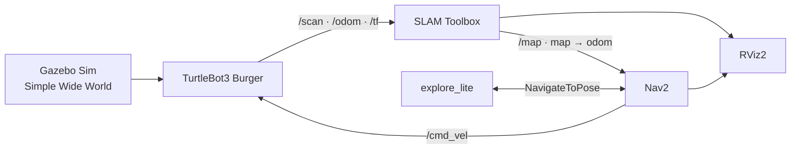

<div align="center">

# ROS 2 Jazzy SLAM & Autonomous Exploration Practice

### 실물 자율주행 로봇 제작 전 진행한 TurtleBot3 기반 2D SLAM·자율탐사 사전 학습

<p>
  
  
  
  
  
</p>

</div>

## 프로젝트 소개

이 프로젝트는 실물 자율주행 로봇을 제작하기 전에 ROS 2의 SLAM과 자율탐사 구조를 익히기 위해 진행한 **사전 학습·연습 프로젝트**입니다.

실물 로봇과 LiDAR 없이 **Gazebo Sim의 가상 센서 데이터**를 이용하여 지도를 작성하고,  
작성 중인 지도에서 TurtleBot3가 자동으로 미탐색 영역을 찾아 이동하도록 구성한 ROS 2 프로젝트입니다.

VMware 위의 Ubuntu 24.04 환경에서 다음 과정을 구현하고 검증하는 것을 목표로 합니다.

- 가상 월드와 TurtleBot3 Burger 시뮬레이션
- `/scan`, `/odom`, TF를 이용한 2D SLAM
- 키보드 조작을 통한 수동 매핑
- Nav2와 `explore_lite`를 이용한 프런티어 기반 자동탐사
- 완성된 지도의 PGM·YAML 파일 저장
- VMware 환경에서 발생하는 TF, DDS, RViz, 성능 문제 진단

> 이 프로젝트는 현재 개발 중입니다. 수동 SLAM과 지도 저장 절차는 구성했으며,
> Nav2 lifecycle과 자동탐사 통합 실행의 안정화를 계속 진행하고 있습니다.

## 주요 기능

| 기능 | 설명 |
|:---|:---|
| Virtual LiDAR | Gazebo에서 `/scan` LaserScan 데이터 생성 |
| 2D SLAM | SLAM Toolbox로 `/map` 작성 및 `map → odom` TF 생성 |
| Manual Mapping | `turtlebot3_teleop`으로 로봇을 직접 조작하며 매핑 |
| Autonomous Exploration | Nav2와 `explore_lite`가 미탐색 프런티어를 탐색 |
| Map Saving | Nav2 Map Saver로 `.pgm`, `.yaml` 지도 저장 |
| Lightweight Simulation | VMware 부하를 줄이기 위한 단순하고 넓은 전용 월드 사용 |

## 시스템 구성



## 개발 환경

| 구분 | 사용 환경 |
|:---|:---|
| Host | Windows + VMware |
| Guest OS | Ubuntu 24.04 LTS |
| Middleware | ROS 2 Jazzy |
| Simulator | Gazebo Sim |
| Robot | TurtleBot3 Burger |
| SLAM | SLAM Toolbox |
| Navigation | Nav2 |
| Exploration | explore_lite |
| DDS | Cyclone DDS |
| Visualization | RViz2 |

## 시뮬레이션 월드

최종 테스트 월드는 복잡한 미로에서 발생한 탐사 실패와 SLAM 왜곡을 줄이기 위해 단순하게 구성했습니다.

- 전체 크기: 약 `18 m × 14 m`
- 넓은 주행 공간과 충분한 회전 반경
- 좁은 복도와 반복되는 벽 구조 최소화
- 정사각형, 원기둥, L자, T자, 대각선 장애물 배치
- Gazebo 그림자 비활성화로 가상머신의 그래픽 부하 감소
- 기본 탐사 속도: 선속도 `0.16 m/s`, 각속도 `0.24 rad/s`

## 패키지 구조

```text
simple_wide_slam_world/
├── CMakeLists.txt
├── package.xml
├── config/
│   └── slam_minimal.yaml
├── launch/
│   ├── simple_world.launch.py
│   ├── simple_mapping.launch.py
│   └── simple_auto_explore.launch.py
├── scripts/
│   ├── start_mapping.sh
│   ├── start_auto.sh
│   └── stop_all.sh
└── worlds/
    └── simple_wide.world
```

## 사전 준비

ROS 2 Jazzy가 설치된 Ubuntu 24.04에서 필요한 패키지를 설치합니다.

```bash
sudo apt update
sudo apt install -y \
  ros-jazzy-desktop \
  ros-jazzy-slam-toolbox \
  ros-jazzy-navigation2 \
  ros-jazzy-nav2-bringup \
  ros-jazzy-turtlebot3 \
  ros-jazzy-turtlebot3-simulations \
  ros-jazzy-ros-gz \
  ros-jazzy-rmw-cyclonedds-cpp \
  python3-colcon-common-extensions
```

`explore_lite`는 워크스페이스의 `src` 폴더에 추가합니다.

```bash
mkdir -p ~/ros2_ws/src
cd ~/ros2_ws/src
git clone https://github.com/robo-friends/m-explore-ros2.git
```

## 빌드

프로젝트 패키지를 `~/ros2_ws/src/simple_wide_slam_world`에 배치한 뒤 의존성을 설치하고 빌드합니다.

```bash
cd ~/ros2_ws
source /opt/ros/jazzy/setup.bash

rosdep install \
  --from-paths src \
  --ignore-src \
  --rosdistro jazzy \
  -r -y

colcon build --symlink-install
source ~/ros2_ws/install/setup.bash
```

패키지가 정상적으로 인식되는지 확인합니다.

```bash
ros2 pkg prefix simple_wide_slam_world
ros2 pkg executables explore_lite
```

## 공통 환경 설정

실행에 사용하는 **모든 터미널에서 동일한 환경 변수**를 사용해야 합니다.

```bash
source /opt/ros/jazzy/setup.bash
source ~/ros2_ws/install/setup.bash

export RMW_IMPLEMENTATION=rmw_cyclonedds_cpp
export TURTLEBOT3_MODEL=burger
```

매번 입력하지 않으려면 `~/.bashrc` 마지막에 추가할 수 있습니다.

```bash
echo 'source /opt/ros/jazzy/setup.bash' >> ~/.bashrc
echo 'source ~/ros2_ws/install/setup.bash' >> ~/.bashrc
echo 'export RMW_IMPLEMENTATION=rmw_cyclonedds_cpp' >> ~/.bashrc
echo 'export TURTLEBOT3_MODEL=burger' >> ~/.bashrc
source ~/.bashrc
```

## 실행 방법

### 1. 수동 SLAM

처음에는 Nav2와 자동탐사를 제외하고 Gazebo·SLAM만 검증합니다.

```bash
ros2 run simple_wide_slam_world stop_all.sh
ros2 run simple_wide_slam_world start_mapping.sh
```

새 터미널에서 키보드 조작 노드를 실행합니다.

```bash
ros2 run turtlebot3_teleop teleop_keyboard
```

SLAM이 뒤틀리지 않는지 확인하기 위한 권장 테스트 순서입니다.

1. 약 1 m 직진
2. 완전히 정지
3. 천천히 90도 회전
4. 완전히 정지
5. 다시 약 1 m 직진

### 2. RViz2

가상머신의 부하를 줄이기 위해 RViz는 별도 터미널에서 실행합니다.

```bash
rviz2 --ros-args -p use_sim_time:=true
```

RViz 설정:

| 항목 | 값 |
|:---|:---|
| Fixed Frame | `map` |
| Map Topic | `/map` |
| LaserScan Topic | `/scan` |
| RobotModel | `/robot_description` |
| LaserScan Style | `Points` |
| LaserScan Decay Time | `0` |
| LaserScan Size | `0.02` |

### 3. 자동탐사

수동 매핑이 안정적인 것을 확인한 뒤 자동탐사를 실행합니다.

```bash
ros2 run simple_wide_slam_world stop_all.sh
ros2 run simple_wide_slam_world start_auto.sh
```

통합 launch의 권장 시작 순서:

| 경과 시간 | 실행 구성 |
|---:|:---|
| 0초 | Gazebo와 TurtleBot3 |
| 8초 | SLAM Toolbox |
| 25초 | Nav2 |
| 45초 | explore_lite |

Nav2가 완전히 활성화되기 전에 `explore_lite`가 시작되면 자동탐사가 멈출 수 있으므로 약 50초 후 상태를 확인합니다.

```bash
ros2 lifecycle get /controller_server
ros2 lifecycle get /planner_server
ros2 lifecycle get /bt_navigator
ros2 lifecycle get /behavior_server
```

정상 상태:

```text
active [3]
active [3]
active [3]
active [3]
```

탐사 노드와 액션 연결을 확인합니다.

```bash
ros2 node list | grep explore
ros2 action info /navigate_to_pose
ros2 topic echo /cmd_vel
```

`/navigate_to_pose`의 Action clients에 `/explore_node`, Action servers에 `/bt_navigator`가 있으면 액션 연결이 구성된 상태입니다.

> `explore_lite` 버전에 따라 `/explore/status` 토픽을 발행하지 않을 수 있습니다.
> 이 경우 `/explore_node`, `/navigate_to_pose`, `/cmd_vel`로 탐사 상태를 확인합니다.

## 지도 저장

매핑이 완료된 상태에서 새 터미널을 열고 실행합니다.

```bash
mkdir -p ~/maps

ros2 run nav2_map_server map_saver_cli \
  -f ~/maps/simple_wide_map
```

저장 결과를 확인합니다.

```bash
ls -lh \
  ~/maps/simple_wide_map.pgm \
  ~/maps/simple_wide_map.yaml
```

## 정상 동작 확인

### 토픽

```bash
ros2 topic list
ros2 topic hz /scan
ros2 topic hz /odom
ros2 topic info /map -v
```

핵심 토픽:

```text
/scan
/odom
/tf
/tf_static
/map
/map_updates
/cmd_vel
/clock
```

### TF

TF 체인은 다음과 같이 연결되어야 합니다.

```text
map
└── odom
    └── base_footprint
        └── base_link
            └── base_scan
```

확인:

```bash
timeout 5s ros2 run tf2_ros tf2_echo map base_link
timeout 5s ros2 run tf2_ros tf2_echo odom base_scan
```

### 시뮬레이션 시간

```bash
ros2 param get /slam_toolbox use_sim_time
ros2 param get /robot_state_publisher use_sim_time
```

두 노드 모두 다음 값을 사용해야 합니다.

```text
Boolean value is: True
```

## 트러블슈팅

### `Package 'simple_wide_slam_world' not found`

```bash
cd ~/ros2_ws
source /opt/ros/jazzy/setup.bash
colcon build --symlink-install --packages-select simple_wide_slam_world
source ~/ros2_ws/install/setup.bash
```

### 지도가 회전하거나 같은 벽이 여러 번 겹침

1. Nav2와 `explore_lite`를 끄고 수동 SLAM부터 확인합니다.
2. 모든 터미널의 `RMW_IMPLEMENTATION`을 Cyclone DDS로 통일합니다.
3. `/scan`, `/odom`, `/clock`이 같은 시뮬레이션 시간대를 사용하는지 확인합니다.
4. `/map`, `/scan`, `/odom`의 Publisher가 중복되지 않았는지 확인합니다.
5. RViz의 LaserScan `Decay Time`을 `0`으로 설정합니다.
6. Gazebo의 Real Time Factor가 지나치게 낮지 않은지 확인합니다.
7. 직진과 회전 사이에 정지 시간을 두고 저속으로 테스트합니다.

### Fast DDS shared-memory 오류

다음 오류는 이전 ROS 프로세스의 shared-memory 포트 충돌로 발생할 수 있습니다.

```text
RTPS_TRANSPORT_SHM Error
Failed init_port fastrtps_port...
```

모든 실행 터미널에서 Cyclone DDS를 사용한 뒤 ROS discovery를 다시 시작합니다.

```bash
export RMW_IMPLEMENTATION=rmw_cyclonedds_cpp
ros2 daemon stop
sleep 2
ros2 daemon start
```

### Nav2가 `inactive` 또는 `unconfigured`

중복 실행된 Nav2와 `explore_lite`를 종료하고, Gazebo·SLAM을 유지한 채 Nav2만 직접 실행하여 오류 로그를 확인합니다.

```bash
ros2 launch nav2_bringup navigation_launch.py \
  use_sim_time:=true \
  params_file:=/opt/ros/jazzy/share/turtlebot3_navigation2/param/burger.yaml \
  autostart:=true
```

15초 후 lifecycle 상태를 다시 확인하고, 모든 서버가 `active [3]`일 때만 `explore_lite`를 시작합니다.

### RViz GLSL 오류 또는 화면 깨짐

VMware의 OpenGL 호환 문제라면 소프트웨어 렌더링으로 실행합니다.

```bash
LIBGL_ALWAYS_SOFTWARE=1 \
rviz2 --ros-args -p use_sim_time:=true
```

## 진행 상황

- [x] VMware Ubuntu 24.04 환경 구성
- [x] ROS 2 Jazzy와 Gazebo Sim 연동
- [x] TurtleBot3 가상 LiDAR·Odometry·TF 연결
- [x] SLAM Toolbox 기반 수동 매핑
- [x] 지도 PGM·YAML 저장
- [x] Cyclone DDS 전환 및 DDS 환경 통일
- [x] Nav2와 `explore_lite` 액션 연결 확인
- [ ] 통합 launch의 Nav2 lifecycle 안정화
- [ ] 자동탐사 전체 구간 완주 검증
- [ ] 실행 결과 이미지와 완성 지도 추가

## 참고 자료

- [ROS 2 Jazzy Documentation](https://docs.ros.org/en/jazzy/)
- [Nav2 Documentation](https://docs.nav2.org/)
- [SLAM Toolbox](https://github.com/SteveMacenski/slam_toolbox)
- [TurtleBot3 e-Manual](https://emanual.robotis.com/docs/en/platform/turtlebot3/overview/)
- [m-explore-ros2](https://github.com/robo-friends/m-explore-ros2)

## Author

**Ryu Jaewook**

- GitHub: [@jwryu765](https://github.com/jwryu765)
- Profile: [github.com/jwryu765](https://github.com/jwryu765)
